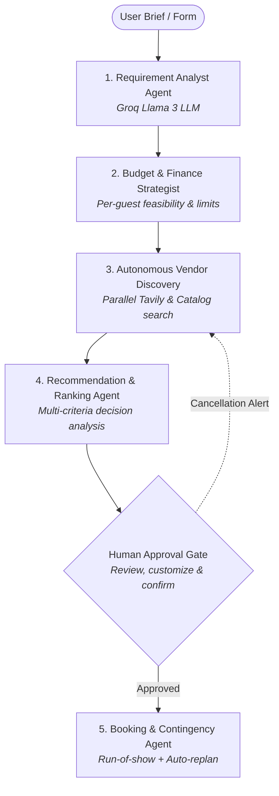

# FlowGenie — Autonomous Multi-Agent AI Event Planner

FlowGenie is an intelligent, multi-agent AI event-planning system. Powered by **Groq (Llama 3)**, **LangGraph**, and **Tavily Web Discovery**, it transforms natural-language event briefs into comprehensive budget allocations, discovers and ranks vendors concurrently, requests human-in-the-loop approval, schedules minute-by-minute run-of-show itineraries, and autonomously recovers if a vendor cancels.

---

## 🤖 5-Agent Architecture



1. **Requirement Analyst Agent**: Extracts guest count, budget bounds, date, location, dietary constraints, and aesthetic themes using Groq Llama 3 (with heuristic fallback).
2. **Budget & Finance Strategist Agent**: Calculates weighted category allocations, per-guest spends, and audits catering per-plate viability.
3. **Autonomous Vendor Discovery Agent**: Performs parallel asynchronous searches across categories using Tavily Web Search, Google Maps API, or local verified supplier catalogs.
4. **Recommendation & Ranking Agent**: Executes Multi-Criteria Decision Analysis (MCDA) across rating, event-fit score, and price efficiency to deliver top-3 ranked options with badges.
5. **Booking & Contingency Agent**: Confirms approved vendors, generates an AI run-of-show day-of-event milestone timeline, and handles dynamic vendor cancellation recovery.

---

## 🛠️ Technology Stack

| Layer | Technology | Purpose |
| :--- | :--- | :--- |
| **LLM** | Groq (Llama 3 / `llama-3.3-70b-versatile`) | Fast, deep reasoning for requirement analysis |
| **Multi-Agent Framework** | CrewAI | Specialized role, goal, and backstory agent definitions |
| **Orchestration** | LangGraph | Stateful workflow graph with conditional approval gates |
| **Search & Discovery** | Tavily Search API | Real-time web supplier discovery |
| **Backend API** | FastAPI | High-performance async REST backend |
| **Frontend UI** | HTML5, CSS3, JavaScript | Modern glassmorphism dashboard with thought console & personalization |
| **Location / Maps** | Google Maps API (Optional) | Location metadata and geocoding |
| **Storage & Memory** | In-Memory + Browser `localStorage` | Thread-safe server state + persistent offline user profiles |

---

## 🚀 Quick Start Guide

### 1. Activate Environment & Install Dependencies
```bash
.venv\Scripts\activate
pip install -r requirements.txt
```

### 2. (Optional) Configure Live API Keys
Copy `.env.example` to `.env` and add your keys for live integrations:
```env
GROQ_API_KEY=your_groq_api_key_here
TAVILY_API_KEY=your_tavily_api_key_here
GOOGLE_MAPS_API_KEY=your_google_maps_api_key_here
```
> *Note: FlowGenie runs 100% offline out-of-the-box if keys are omitted, using built-in high-fidelity catalogs and heuristic fallbacks.*

### 3. Start the Application
```bash
python run_local.py
```
Open your browser at: **`http://127.0.0.1:8000/`**

---

## 🧪 Testing

Run the automated integration test suite:
```bash
.venv\Scripts\python test_full_flow.py
.venv\Scripts\python test_personalization.py
```

---

## 📋 API Reference

* `POST /plan` — Orchestrates Requirements, Budget, Vendor Discovery, and Recommendation agents. Returns recommendations + agent thought logs.
* `POST /approve` — Human-in-the-loop checkpoint. Locks in selected vendors, initializes monitoring, and generates the **Run-of-Show Timeline**.
* `GET /status/{event_id}` — Retrieves real-time event status, timeline progress, active alerts, and run-of-show schedule.
* `POST /replan` — Simulates/handles vendor cancellation in a specific category, triggering autonomous discovery of backup alternatives.
* `GET /health` — Verifies server health.
